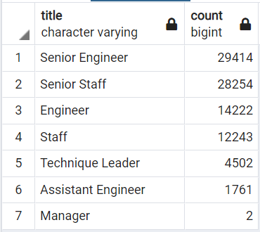
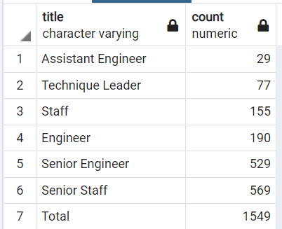
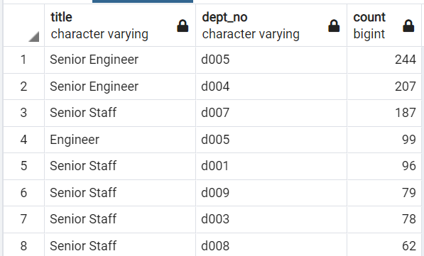

# Pewlett-Hackard Analysis

## Overview 
Pewlett-Hackard is offering retirement package to employees who are meeting certain criteria and interested to know what will be the future requirements of new employees, how many employees are going to retire and how many positions need to be filled up. This project is carried out to dig in company database and identify who all will be retiring in next few years and how many positions will be required to fill.
## Purpose
The purpose of this analysis is to identify employees who will be retiring in next few years grouped by titles and the number of employees who are eligible to participate in mentorship program. 

## Results

We have tried to find two different information about the retirement plan Pewlett-Hackard is planning in next few years. One is the number of employees retiring by their titles and number of employees eligible for the mentorship program. Let us look both of these two information one by one.

 
Fig # 7.1 Number of Retiring Employees by Titles

Retiring Employees grouped by titles:

•	The total number of employees that will be retiring are 90398 as per the criteria set by Pewlett-Hackard.

•	Maximum number of employees retiring would be with “Senior Engineer” and “Senior Staff” titles. However, employees with “Manager” title will be the lowest in numbers who will be retiring in near future for Pewlett-Hackard.

Fig # 7.1 Number of Employees Eligible for Mentorship Program by Title

Employees eligible for Mentorship Program:

•	Total number of employees eligible for mentorship program are 1549 as per the set criteria.

•	Number of employees qualified for mentorship program are highest with “Senior Staff” title and no employee got qualified for mentorship with “Manager” title. 

## Summary
The information extracted from database of Pewlett Hackard provides details about the number of employees possibly going to retire in near future. It also gives us information regarding the employees available to be part of mentorship program and help the company to sustain the loss of experienced employees. However, the two specific questions are answered as below:

How many roles will need to be filled as the "silver tsunami" begins to make an impact?

-	There will be 7 titles or roles need to be filled as “silver tsunami “begins. In total 90398 employees from these 7 different roles need to filled with appropriate candidate. 

Are there enough qualified, retirement-ready employees in the departments to mentor the next generation of Pewlett Hackard employees?

-	The percentage of employees who can mentor the next generation to the employees retiring ranges around 1-2 %. The numbers are not the best but, if utilized in best possible way, it can be good enough to train the new employees. However, Manager title does not have an available mentoring employee and that could be a matter of concern. 

### Two different tables or Queries possible to help the analysis can be as below:

1.	The table I used in the earlier part of this paper; number of employees eligible for mentorship program by title is very helpful to understand the division of the mentorship ready employees by department. We can also make it more helpful by making it by department and by title. 

Query used to get the number of employees ready for the mentorship by titles:

SELECT * FROM 

(

SELECT title, COUNT(emp_no) AS count  

FROM mentorship_eigibility

GROUP BY title 

UNION ALL

SELECT 'Total', SUM(COUNT(emp_no))  OVER() 

FROM mentorship_eigibility

) AS det

ORDER BY det.count

Query used to get the number of employees ready for the mentorship by titles by department:

SELECT me.title, de.dept_no, count(me.emp_no) AS count

FROM mentorship_eigibility AS me

INNER JOIN dept_emp AS de

ON (me.emp_no = de.emp_no AND me.to_date = de.to_date)

GROUP BY me.title, de.dept_no

ORDER BY count DESC

O/P:

 

2.	Similarly, table can be prepared for the employees getting retired by department and by title. 
We can prepare table using unique_table we created in deliverable#2, but unfortunately we have not taken the to_date field which is required to avoid duplicity of emp_no in joined table. 

SELECT ut.title, de.dept_no, count(ut.emp_no) AS count

FROM unique_titles AS ut 

LEFT JOIN dept_emp AS de

ON (ut.emp_no = de.emp_no  AND ut.to_date = de.to_date)

GROUP BY ut.title, de.dept_no

ORDER BY count DESC

